[](https://www.npmjs.com/package/git-commit-msg-linter)
[](http://standardjs.com)
[](https://www.typescriptlang.org/)

# Node Typescript API

- [x] Clean Architecture (CA)
- [x] Domain Driven Design (DDD)
- [x] Test Driven Development (TDD)
- [x] Clean Code
- [x] S.O.L.I.D.
- [x] TypeScript

## Getting Started

Clone this repository:

```bash
git clone https;//github.com/EsattoDigital/node-typescript-api.git
```

After that, get into the project folder, and run the following command to install all dependencies:

> **(make sure to be inside the project folder before running any command)**

```bash
npm install
```

Note that at the root of the project folder, you will find a `.env.sample` file that contains all the environment variables that you need to set up the project. So go ahead and copy it to `.env` make the necessary changes.

**If you're only going to run tests over the features you're developing, you can stop here.**

With the environment variables set up, you can start the Docker container. If you don't have Docker installed, go to [Docker Download Page](https://docs.docker.com/engine/install/) and [Docker Compose Download Page](https://docs.docker.com/compose/install/) before continuing. If you're all set, run the following command:

```bash
docker-compose up --build
```

The `--build` flag will build the Docker images for you. You only need to use that flag the first time you run the command.

With all that setup, you should be able to run the following command to start the server:

```bash
npm run dev
```

## Testing

This project is built with [Jest](https://jestjs.io/). All tests are under `tests` folder. Tests with extension
`.spec.ts` are unit tests, tests with extension `.test.ts` are integration tests and tests with extension `.e2e.ts`
are end-to-end tests.

The project also uses other helpful tools for testing such as:

* [jest-extended](https://www.npmjs.com/package/jest-extended): Additional Jest matchers - https://github.com/jest-community/jest-extended
* [jest-mock-extended](https://www.npmjs.com/package/jest-mock-extended): Type safe mocking extensions for Jest - https://github.com/marchaos/jest-mock-extended
* [pg-mem](https://www.npmjs.com/package/pg-mem): An in memory postgres DB instance for your unit tests - https://github.com/oguimbal/pg-mem

The coverage policy of this project is to achieve 300% coverage of tests, meaning that all production code must be
covered 100% three times, one for unit tests, one for integration tests and one for end-to-end tests.

To run all tests, run the following command:

```bash
npm run test
```

To run tests in watch mode, run the following command:

```bash
npm run test:watch
```

To run tests related to staged changes, run the following command:

```bash
npm run test:staged
```

To run coverage, run the following command:

```bash
npm run test:coverage
```

## Authorization Server: OpenID Connect and OAuth 2.0 - Keycloak

The application utilizes the [Keycloak](https://www.keycloak.org/) OpenID Connect and OAuth 2.0 server. For development,
we use the Docker [jboss/keycloak](https://hub.docker.com/r/jboss/keycloak/) image, which is configured to use the
[postgres](https://www.postgresql.org/) database, so make sure the credentials and host for the database are set up
correctly in `docker-compose.yml`.

With the **docker-compose** up, you can access the Keycloak administration console at the following URL:

> http://localhost:8080/

After that, got to **`Administration Console >`**.

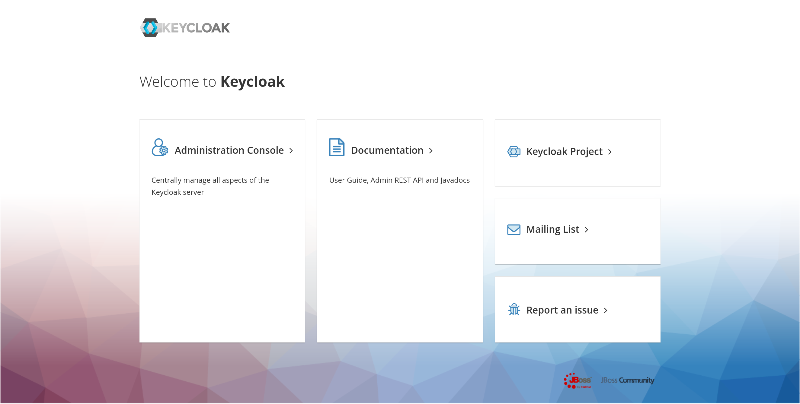

Then use the default credentials to login, you can change that in `docker-compose.yml`, but notice that you will need to
delete the Keycloak container and re-launch it.

> **Username:** admin

> **Password:** admin

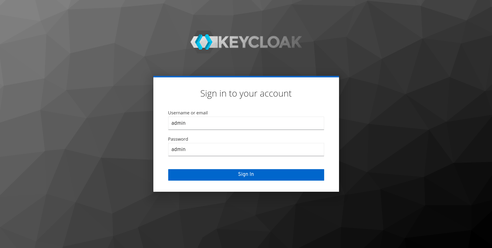

When you log in, you will see the **Master Realm** home page, which is the default realm. Be careful, do not delete the
**Master Realm** or leak any information about it, having access to it is a huge security risk.

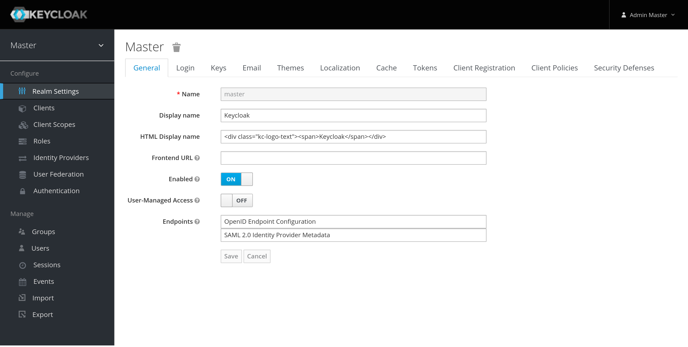

The next step is to create a new realm. For instance, we will create a realm called **`controwl-app-development`**.
Which will be the realm that will be used for the local development of the application. You can create as many realms
as you need for other applications.

In the `Master Realm Home`, click at `Master  ⌄` > `Add Realm`

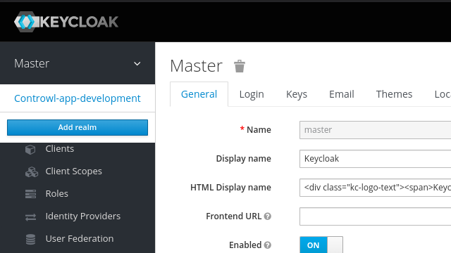

Then name it with `controwl-app-development` and click `Create`. The name `controwl-app-development` is important,
it will be used as a `KEYCLOAK_REALM` parameter in the environment variables, so make sure to remember it.

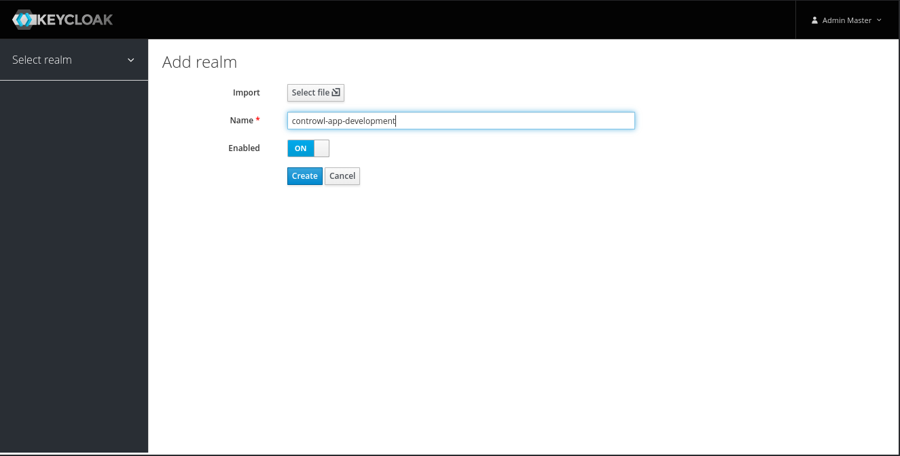

Next, you will need to configure the realm. In the `General` tab, there is a important configuration option called
`Frontend URL`, which need to be set to `http://localhost:8080/auth`. If not set, Keycloak will generate not expected
redirect links. The other options, you can just set as the following image:

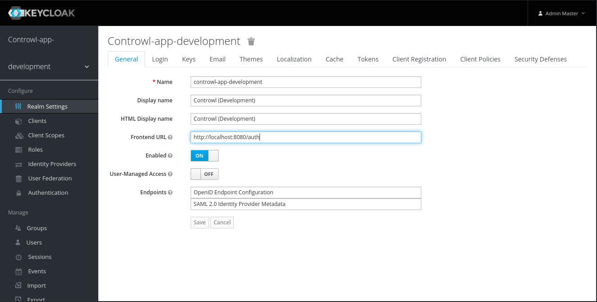

Now go to `Login` tab, to configure Keycloak default login page. So turn on the following options:

- Email as username
- Forgot password
- Remember me
- Verify email
- Login with email

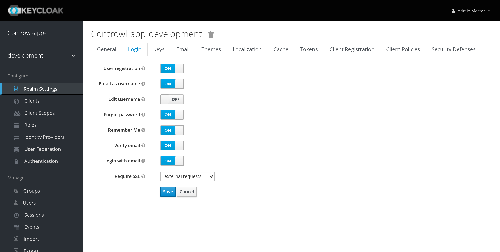

One more important thing is to configure an email account to send the verification emails. In the `Email` tab, you
will see some email parameters to configure, but first, you will need to configure the admin account email to receive
the test email. Click at `Admin ⌄` > `Manage account` at the right top corner.

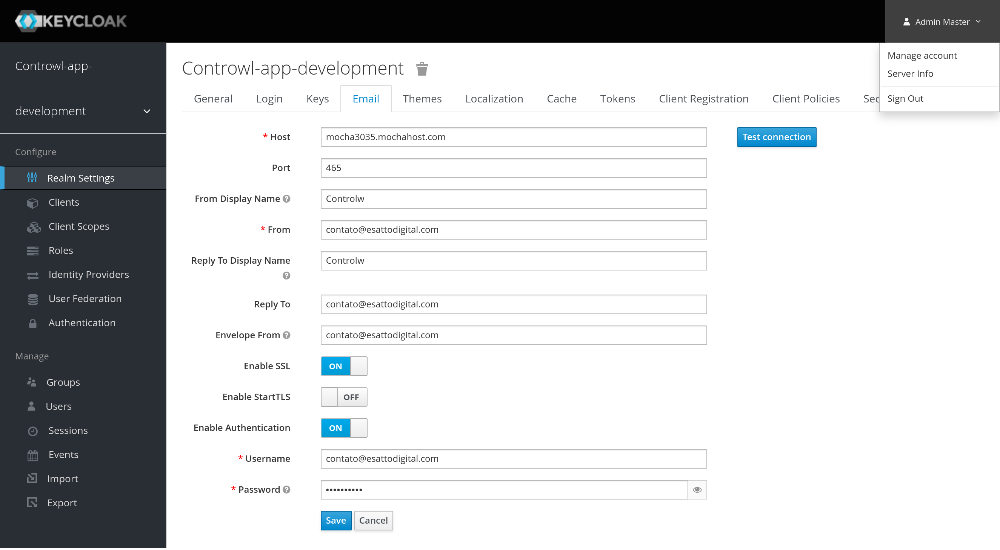

Then go to `Personal Info`.

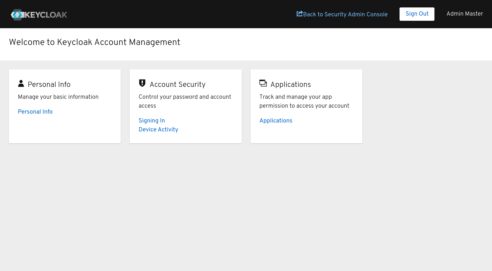

Fill `Email`, `First name`, and `Last name` fields and click in `Save`. Finally click at `Back to Security Admin Console`
to go back to Email settings.

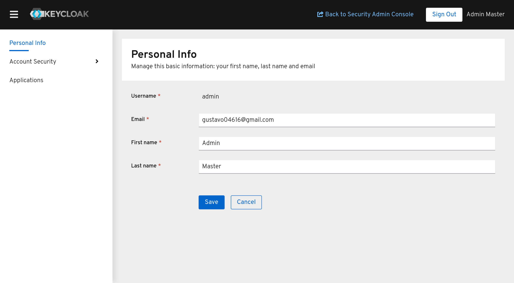

The last thing to do is to configure the email account to send the test email. Fill the fields with any email settings
you want to use and click in `Save` and `Test connection`. If you receive the email registered at the admin account,
then you can proceed with the next's steps.

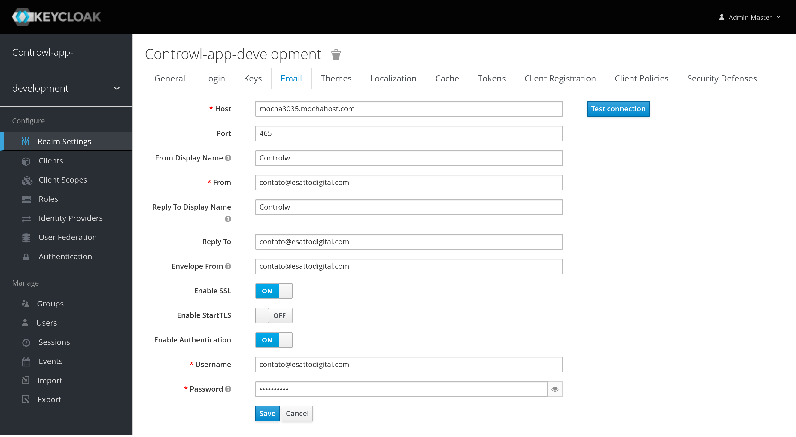

With the email configuration done, go to `Themes` tab, enable the option `Internalization Enabled` and set the
`Default Locale` to `pt-BR`.

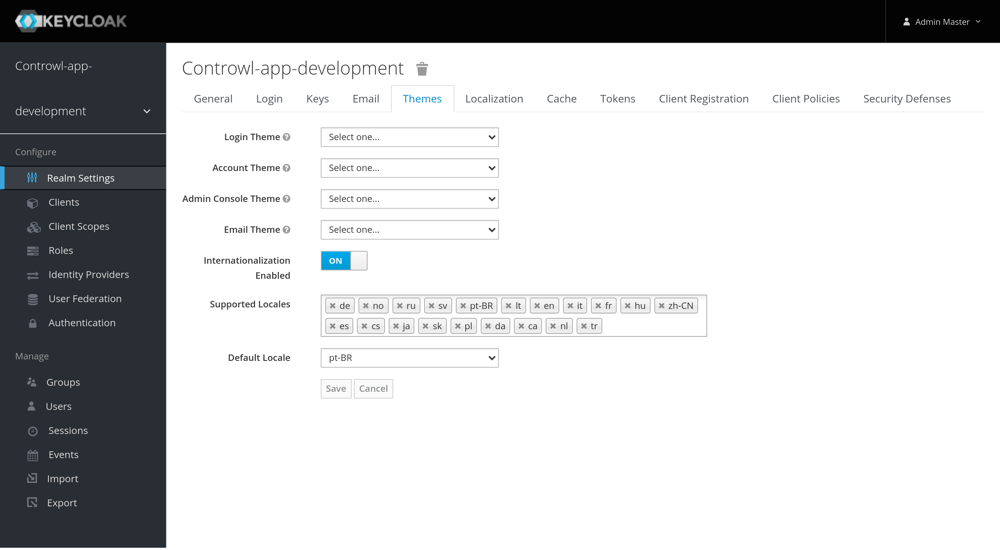

Now we need to add a **Client** to who will consume the Keycloak REST API, here there are important settings to pay
attention or the API will fail to work. So, in te right panel, go to `Clients` and then go to `Create`.

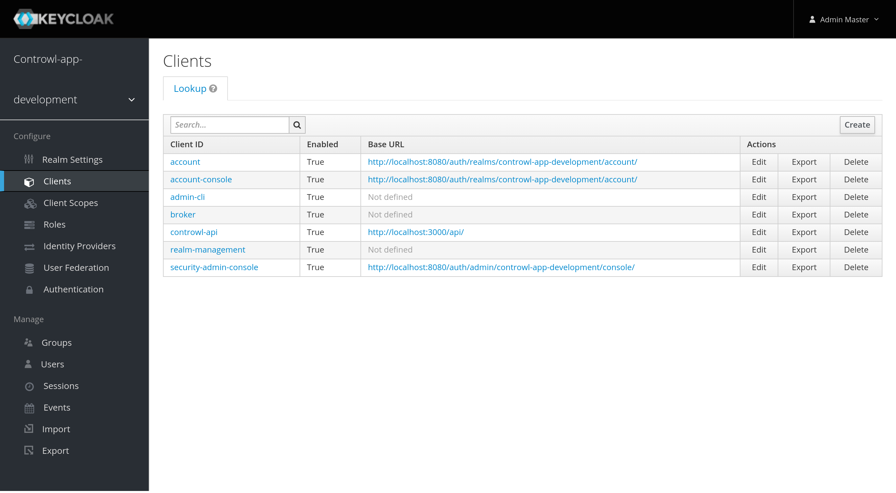

Set the field `Client ID` as `controwl-api`, which will be used as a `KEYCLOAK_CLIENT_ID` parameter in the environment
variables, so make sure to remember it. The field `Root URL` must be filled with the application root URL, in this case
is `http://localhost:3000/api`, if you set another port for example, then change it here too.

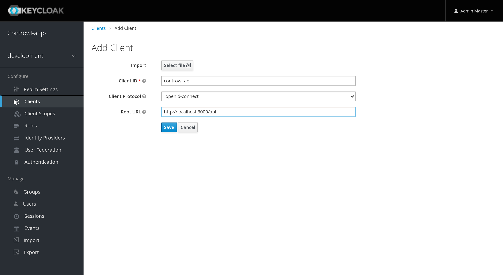

In the `Settings` tab, is important to change `Access Type` to `confidential` and enable the option
`Service Accounts Enabled`. At the bottom of the page click at `Save`.

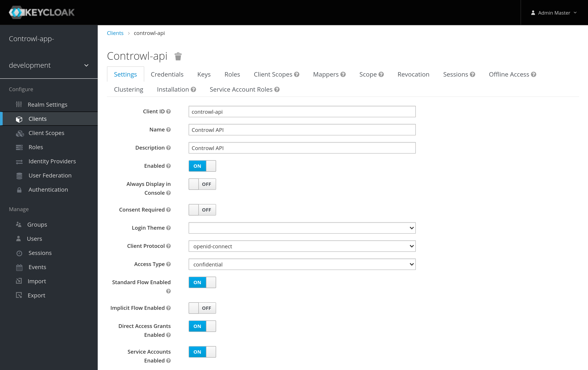

In the `Credentials` tab copy the `Secret` key and add this to `KEYCLOAK_CLIENT_SECRET` in the `.env` file.

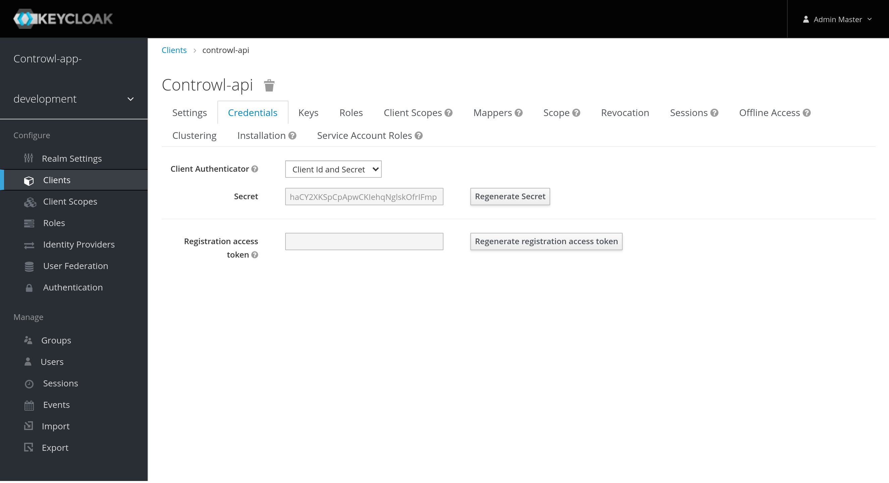

Last, go to `Service Account Roles` > `Client Roles` > `realm-management` > `realm-admin` > `Add selected »`

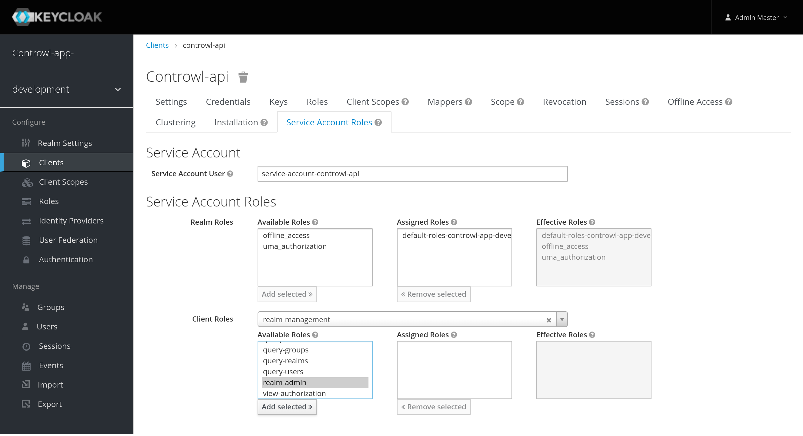

You are all set with Keycloak!
